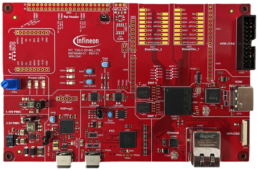

# TRAVEO&#8482; T2G ModusToolbox&#8482;
TRAVEO&#8482; T2G is available with ModusToolbox&#8482;.
TRAVEO&#8482; T2G code example is made up of two parts: the default code examples and the additional code examples.
The additional code examples are available for TRAVEO&#8482; T2G devices in this repository.

Please refer the [ModusToolbox&#8482; software](https://github.com/Infineon/modustoolbox-software) for ModusToolbox&#8482;. It is recommended using latest ModusToolbox&#8482; software.

## Supported device
- [TRAVEO&#8482; T2G body high MCU](https://www.infineon.com/cms/en/product/microcontroller/32-bit-traveo-t2g-arm-cortex-microcontroller/32-bit-traveo-t2g-arm-cortex-for-body/traveo-t2g-cyt4bf-series/): CYT4BFBCHE, CYT4BF8CDS
- [TRAVEO&#8482; T2G Body Entry MCU](https://www.infineon.com/cms/en/product/microcontroller/32-bit-traveo-t2g-arm-cortex-microcontroller/32-bit-traveo-t2g-arm-cortex-for-body/traveo-t2g-cyt2bl-series/): CYT2BL5CAS
- [TRAVEO&#8482; T2G cluster 2D MCU](https://www.infineon.com/cms/en/product/microcontroller/32-bit-traveo-t2g-arm-cortex-microcontroller/32-bit-traveo-t2g-arm-cortex-for-cluster/traveo-t2g-cyt4dn/): CYT4DNJBZS

## Application note
[AN235305](https://www.infineon.com/assets/row/public/documents/10/42/infineon-an235305-getting-started-with-traveo-t2g-family-mcus-in-modustoolbox-applicationnotes-en.pdf?fileId=8ac78c8c8b6555fe018c1fddd8a72801) - GETTING STARTED WITH TRAVEO&#8482; T2G FAMILY MCUS IN MODUSTOOLBOX&#8482;

## Code Example
Each Code example provides a README.md file to learn more about that code example, as well as how to use it to create an application. Each README.md contains the following information:

- **Device**: The devices used by code example
- **Board**: The evaluation kit used by code example
- **Scope of work**: An abstract of code example
- **Introduction**: A generic introduction on the used module and it main features
- **Hardware setup**: The used hardware and how to configure it
- **Implementation**: A detailed explanation of how to implement the module's configuration using HAL and/or PDL and exploits their features
- **Run and Test**: The steps to follow to make sure the code is working properly and interact with it
- **References**: Related documents and web pages

## How to use the Graphics demonstration with ModusToolbox&#8482; and Qt Design Studio
KIT_T2G-C-2D-6M_LITE has a demonstration code example ModusToolbox&#8482; and Qt Design Studio working together to output image. To use these graphics code examples, it is requored some configuration in advance. See the [Steps to use the Qt Design Studio using the ModusToolbox&#8482;](https://www.infineon.com/assets/row/public/documents/10/56/infineon-steps-to-use-the-qt-design-studio-using-the-modustoolbox-training-en.pdf?fileId=8ac78c8c9715623e01973b3fe6e520a4) for more details.

## Evaluation kit
The code examples support the following types of boards:  
*Figure 5. KIT_T2G-B-H_EVK*  
*Figure 6. KIT_T2G-B-H_LITE*  
*Figure 7. KIT_T2G-B-E_LITE*  
*Figure 8. KIT_T2G_C-2D-6M_LITE*   

|   Overview|[KIT_T2G-B-H_EVK](https://www.infineon.com/cms/en/product/evaluation-boards/kit_t2g-b-h_evk/)  |[KIT_T2G-B-H_LITE](https://www.infineon.com/cms/en/product/evaluation-boards/kit_t2g-b-h_lite/)  |[KIT_T2G-B-E_LITE](https://www.infineon.com/cms/en/product/evaluation-boards/kit_t2g-b-e_lite/)|[KIT_T2G_C-2D-6M_LITE](https://www.infineon.com/cms/en/product/evaluation-boards/kit_t2g_c-2d-6m_lite/)|
|-------------------------------|------------------------|--------------------------|-------------------------|-------------------------|
|MCU                            |CYT4BFBCHE (272pin-BGA) |CYT4BF8CDS (176pin-TEQFP) |CYT2BL5CAS (100pin-LQFP) |CYT4DNJBZS (327pin-BGA) |
|Kitprog3 programming/Debug     |✓ (USB Micro-B connector)|✓ (USB Micro-B connector)|✓ (USB Micro-B connector)|✓ (USB Type-C connector)|
|USER LEDs/Buttons/Potentiometer|✓                       |✓                        |✓                        |✓                        |
|CAN FD                         |✓                       |✓                        |✓                        |✓                        |
|Ethernet interface             |10MBPS/100MBPS/1GBPS    |10/100 Mbps               |Not Available            |10MBPS/100MBPS/1GBPS     |
|External memory                |512 MB serial NOR flash memory x1|512 MB Quad SPI NOR flash x2|Not Available|64 Mb HYPERRAM™ x1,  512 Mb SEMPER™ flash x1|
|Z-USB™ FX3 interface           |Not Available           |Not Available             |Not Available            |✓ (USB Type-C connector)     |
|MIPI CSI-2 camera module interface|Not Available        |Not Available             |Not Available            |✓                        |
|Dual LVDS to HDMI interface    |Not Available           |Not Available             |Not Available            |✓                        |
|Arduino                        |✓                       |✓                        |✓                        |✓                        |
|Shield2go                      |Not Available           |✓                        |✓                        |✓                        |
|MikroBUS                       |Not Available           |✓                        |✓                        |✓                        |
|Raspberry Pi interface         |Not Available           |Not Available             |Not Available            |✓                        |
