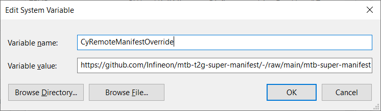
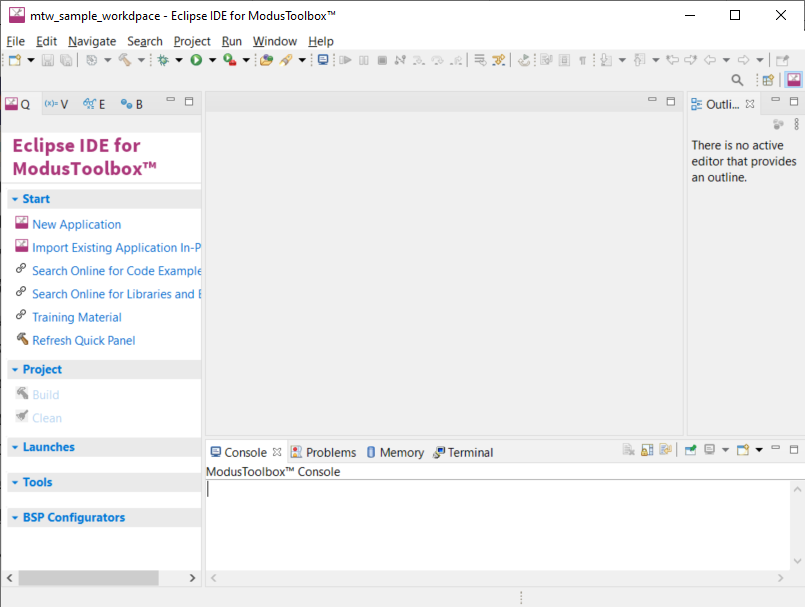
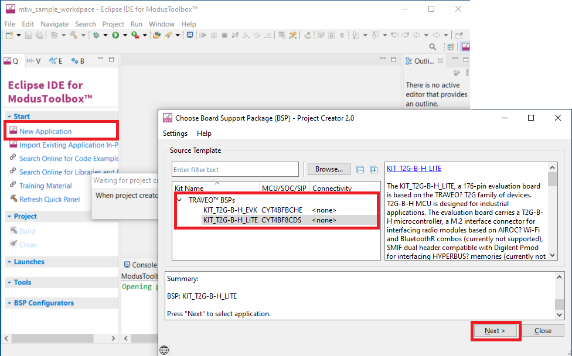
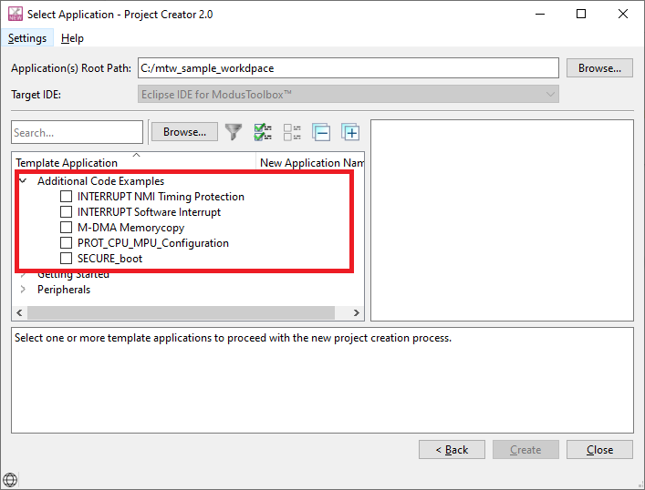
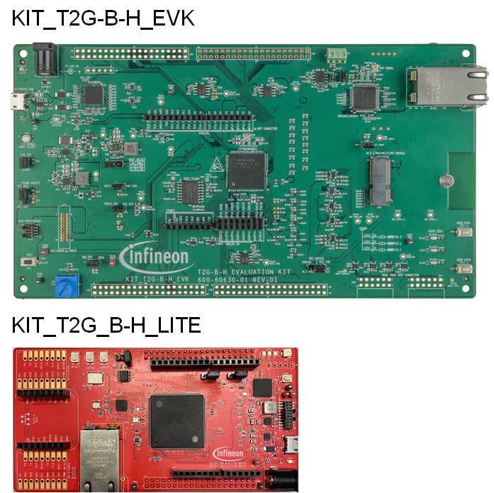

# Code examples for TRAVEO™ T2G ModusToolbox™
TRAVEO™ T2G is available with ModusToolbox™.
TRAVEO™ T2G code example is made up of two parts: the default code examples and the additional code examples.
The additional code examples are available for TRAVEO™ T2G devices in this repository.

To use a code example into ModusToolbox™, follow the guide at **[How to setup](#How-to-setup)**.

Please refer the [ModusToolbox™ software](https://github.com/Infineon/modustoolbox-software) for ModusToolbox™

NOTE: For any question or request, please use the dedicated [Infineon ModusToolbox™ forum](TODOLONK).

## Code Example
Each Code example provides a README.md file to learn more about that code example, as well as how to use it to create an application. Each README.md contains the following information:

- **Device**: The devices used by code example
- **Board**: The evariation kit used by code example
- **Scope of work**: An abstract of code example
- **Introduction**: A generic introduction on the used module and it main features
- **Hardware setup**: The used hardware and how to configure it
- **Implementation**: A detailed explanation of how to implement the module's configuration using HAL and/or PDL and exploits their features
- **Run and Test**: The steps to follow to make sure the code is working properly and interact with it
- **References**: Related documents and web pages

## How to setup
To use the additional code examples, set the following environment variable on your PC to use the additional code examples

- Variable = CyRemoteManifestOverride
- Path = https://github.com/Infineon/mtb-t2g-super-manifest/-/raw/main/mtb-super-manifest-fv2.xml

*Figure 1. System variable setting* 

From the menu, run the Eclipse IDE for ModusToolbox™ 3.0 application. Then, open the Eclipse IDE windowv after workspace location setting.

*Figure 2. ModusToolbox™ Eclipse IDE* 

- Click the **New Application** of Start in the Quick Panel, after that, open the Project creator.
- Select the Board support package (BSP) what want to use, and click the **Next>** button.

*Figure 3. Project Creator* 

- Open the Select application window. You can use additonal code example for TRAVEO™ T2G.

*Figure 4. Select application* 

## Evariation kit
The code examples supports the following types of boards:  
*Figure 5. Evariation kit view* 

|   Overview                    |KIT_T2G-B-H_EVK         |KIT_T2G_B-H_LITE          |
|-------------------------------|------------------------|--------------------------|
|MCU                            |CYT4BFBCHE (272pin-BGA) |CYT4BF8CDS (176pin-TEQFP) |
|Kitprog3 programming/Debug     |✓                       |✓                        |
|USER LEDs/Buttons/Potentiometer|✓                       |✓                        |
|CAN FD                         |✓                       |✓                        |
|Ethernet interface             |1 Gbps Ethernet         |10/100 Mbps Ethernet      | 
|QSPI memory                    |512 MB x1               |512 MB x2                 |
|Arduino                        |✓                       |✓                        |
|Shield2go                      |N/A                     |✓                        |
|MikroBUS                       |N/A                     |✓                        |
