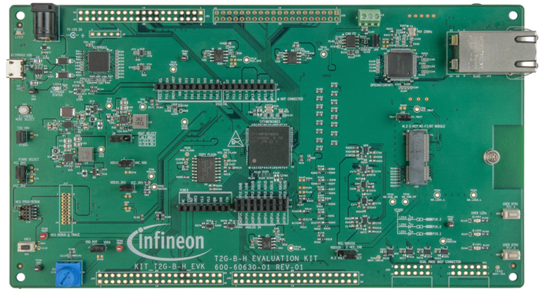
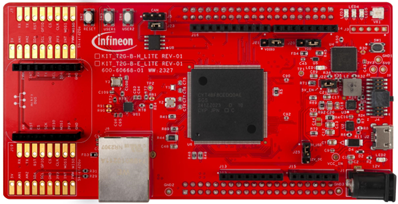
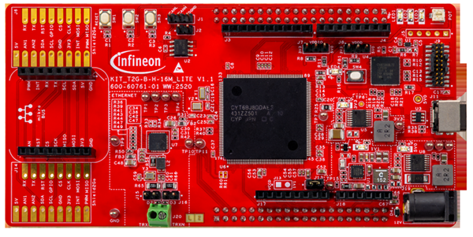
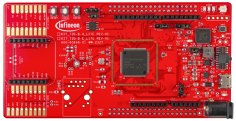
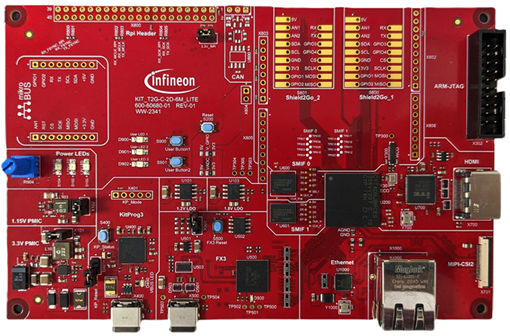
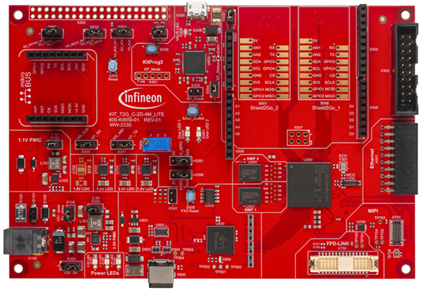

# TRAVEO&trade; T2G ModusToolbox&trade;

TRAVEO&trade; T2G is available with ModusToolbox&trade;.
TRAVEO&trade; T2G code example is made up of two parts: the default code examples and the additional code examples.
The additional code examples are available for TRAVEO&trade; T2G devices in this repository.

Please refer the [ModusToolbox&trade; software](https://github.com/Infineon/modustoolbox-software) for ModusToolbox&trade; on GitHub. Also refer [here](https://www.infineon.com/design-resources/development-tools/sdk/modustoolbox-software) for details.

It is recommended using latest ModusToolbox&trade; software.

## Supported device
- [TRAVEO&trade; T2G body high CYT4BF series MCU](https://www.infineon.com/cms/en/product/microcontroller/32-bit-traveo-t2g-arm-cortex-microcontroller/32-bit-traveo-t2g-arm-cortex-for-body/traveo-t2g-cyt4bf-series/): CYT4BFBCHE, CYT4BF8CDS
- [TRAVEO&trade; T2G body high CYT6BJ series MCU](https://www.infineon.com/products/microcontroller/32-bit-traveo-t2g-arm-cortex/for-body/t2g-cyt6bj): CYT6BJ8DDE
- [TRAVEO&trade; T2G Body Entry CYT2BL series MCU](https://www.infineon.com/cms/en/product/microcontroller/32-bit-traveo-t2g-arm-cortex-microcontroller/32-bit-traveo-t2g-arm-cortex-for-body/traveo-t2g-cyt2bl-series/): CYT2BL5CAS
- [TRAVEO&trade; T2G cluster 2D CYT4DN series MCU](https://www.infineon.com/products/microcontroller/32-bit-traveo-t2g-arm-cortex/for-cluster/t2g-cyt4dn): CYT4DNJBZS
- [TRAVEO&trade; T2G cluster 2D CYT3DL series MCU](https://www.infineon.com/products/microcontroller/32-bit-traveo-t2g-arm-cortex/for-cluster/t2g-cyt3dl): CYT3DLBBHS

## Application note
[AN235305](https://www.infineon.com/assets/row/public/documents/10/42/infineon-an235305-getting-started-with-traveo-t2g-family-mcus-in-modustoolbox-applicationnotes-en.pdf?fileId=8ac78c8c8b6555fe018c1fddd8a72801) - GETTING STARTED WITH TRAVEO&trade; T2G FAMILY MCUS IN MODUSTOOLBOX&trade;

## Code Example
There is code example on Github. Each Code example provides a README.md file to learn more about that code example, as well as how to use it to create an application.

## How to apply ModusToolbox&trade; to your own hardware
All ModusToolbox&trade; applications require a target BSP. Infineon provides BSPs for all of our kits, as well as generic BSPs for each chip architecture, to use as a starting point. For example, you can see generic BSPs in supported device. When working with your own hardware, you can modify an Infineon BSP to match that hardware, or you can create a BSP by specifying the device(s) it contains. The BSP Assistant helps to simplify the process of creating or modifying a BSP to suit your needs. See the following document how to use BSP Assistant tool. 

- [ModusToolbox&trade; BSP Assistant user guide](https://www.infineon.com/ModusToolboxBSPAssistant)
- [MODUSTOOLBOX&trade; USAGE: How to create own BSP using BSP-assistant tool for TRAVEO T2G/PSOC 4 HV](https://www.infineon.com/assets/row/public/documents/10/56/infineon-infineon-002-36696-0a-v-how-to-create-own-bsp-using-bsp-assistant-tool-training-en-training-en.pdf)

## TRAVEO&trade; T2G cluster 2D series graphics solutions
KIT_T2G_C-2D-6M_LITE has two types of graphics solutions; Qt Design Studio and Infineon GFX driver. And KIT_T2G_C-2D-4M_LITE has Infineon GFX driver as graphics solutions.
### Graphics demonstration with Qt Design Studio
KIT_T2G_C-2D-6M_LITE has demonstration code examples ModusToolbox&trade; and Qt Design Studio working together to output image. It will enable users to quickly start with the evaluation process and contribute to solution development using Qt design studio. Please make sure to check out [here](https://github.com/orgs/Infineon/repositories?language=&q=topic%3Agraphics+demonstration&sort=&type=all). 
To use these graphics code examples, it is required some configuration in advance. See the [Steps to use the Qt Design Studio using the ModusToolbox&trade;](https://www.infineon.com/assets/row/public/documents/10/56/infineon-steps-to-use-the-qt-design-studio-using-the-modustoolbox-training-en.pdf?fileId=8ac78c8c9715623e01973b3fe6e520a4) for more details.

### Graphics code example using Infineon GFX driver
[Graphics Driver for Traveo II Cluster](https://github.com/Infineon/tviic2d-gfx-mw) is standalone graphics driver software, it provides interface for graphics sub-system in T2G Cluster devices. KIT_T2G_C-2D-6M_LITE and KIT_T2G_C-2D-4M_LITE have code example using GFX driver. It will allow users to develop using most of the functions of the graphics sub-system in T2G cluster devices. Please make sure to check out [here](https://github.com/orgs/Infineon/repositories?language=&q=topic%3Agraphics+gfx-middleware&sort=&type=all).

## Evaluation kit
The code examples support the following types of boards:  
*Figure 1. KIT_T2G-B-H_EVK*  
*Figure 2. KIT_T2G-B-H_LITE*  
*Figure 6. KIT_T2G_B-H-16M_LITE*  
*Figure 3. KIT_T2G-B-E_LITE*  
*Figure 4. KIT_T2G_C-2D-6M_LITE*  
*Figure 5. KIT_T2G_C-2D-4M_LITE*  
*Figure 6. KIT_T2G_C-2D-4M_LITE*  

## TRAVEO&trade; T2G Body High Series
|Overview|[KIT_T2G-B-H_EVK](https://www.infineon.com/evaluation-board/KIT-T2G-B-H-EVK)|[KIT_T2G-B-H_LITE](https://www.infineon.com/evaluation-board/KIT-T2G-B-H-LITE)|[KIT_T2G-B-H-16M_LITE](https://www.infineon.com/design-resources/finder-selection-tools/evaluation-board)|
|-------------------------------|------------------------|--------------------------|-------------------------|
|MCU |CYT4BFBCHE (272pin-BGA) |CYT4BF8CDS (176pin-TEQFP) |CYT6BJ8DDE (176pin-TEQFP) |
|Kitprog3 programming/Debug   |✓ (USB Micro-B connector)|✓ (USB Micro-B connector)|✓ (USB Type-C connector)|
|USER LEDs/Buttons/Potentiometer|✓|✓|✓|
|CAN FD|✓|✓|✓|
|Ethernet interface|10 Mbps/100 Mbps/1 Gbps|10 Mbps/100 Mbps|10Base-T1S|
|External memory|512 MB serial NOR flash memory x1|512 MB Quad SPI NOR flash x2|512 Mb SEMPER&trade; Flash x2|
|Arduino|✓|✓|✓|
|Shield2go|Not Available|✓|✓|
|MikroBUS|Not Available|✓|✓|
 

## TRAVEO&trade; T2G Body Entry Series
|Overview|[KIT_T2G-B-E_LITE](https://www.infineon.com/evaluation-board/KIT-T2G-B-E-LITE)|
|-------------------------------|-------------------------|
|MCU |CYT2BL5CAS (100pin-LQFP) |
|Kitprog3 programming/Debug   |✓ (USB Micro-B connector)|
|USER LEDs/Buttons/Potentiometer|✓|
|CAN FD|✓|✓|✓|
|Arduino|✓|✓|✓|
|Shield2go|✓|
|MikroBUS|✓|
 

## TRAVEO&trade; T2G Cluster Series
|Overview|[KIT_T2G_C-2D-6M_LITE](https://www.infineon.com/evaluation-board/KIT-T2G-C-2D-6M-LITE)|[KIT_T2G_C-2D-4M_LITE](https://www.infineon.com/evaluation-board/KIT-T2G-C-2D-4M-LITE)|
|-------------------------------|------------------------|--------------------------|
|MCU|CYT4DNJBZS (327pin-BGA) |CYT3DLBBHS (272pin-BGA) |
|Kitprog3 programming/Debug|✓ (USB Type-C connector)|✓ (USB Micro-B connector)|
|USER LEDs/Buttons/Potentiometer|✓|✓|
|CAN FD                         |✓|Supported with external shields |
|Ethernet interface             |10MBPS/100MBPS/1GBPS|Supported with external shields |
|External memory                |64 Mb HYPERRAM&trade; x1,  512 Mb SEMPER&trade; Flash x1|64 Mb HYPERRAM&trade; x1,  512 Mb SEMPER&trade; Flash x1|
|Z-USB™ FX3 interface           |✓ (USB Type-C connector)|✓ (USB Type-C connector)|
|MIPI CSI-2 interface           |✓|✓|
|FPD-Link interface             |HDMI interface for FPDLINK/Dual-FPDLINK output|Single-channel FPD-Link/LVDS interface for up to 1920 x 720 video output |
|Arduino                        |✓|✓|
|Shield2go                      |✓|✓|
|MikroBUS                       |✓|✓|
|Raspberry Pi interface         |✓|✓|

## Developer Community
For questions and support, use the TRAVEO™ T2G Forum:  
- <https://community.infineon.com/t5/TRAVEO-T2G/bd-p/TraveoII>

